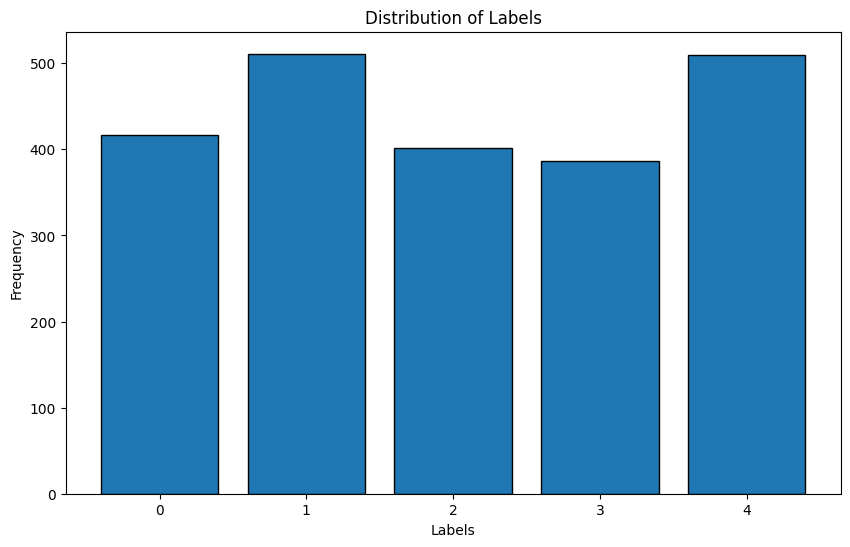
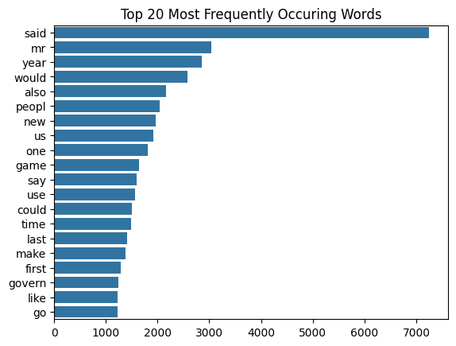
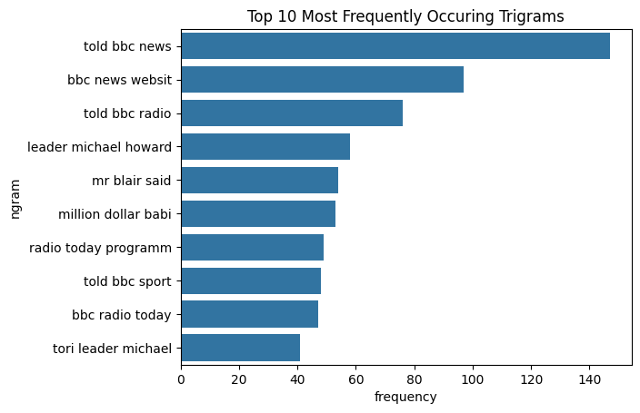
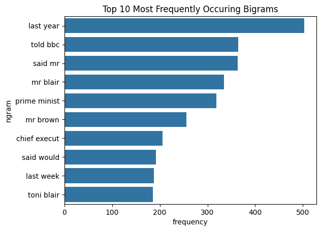
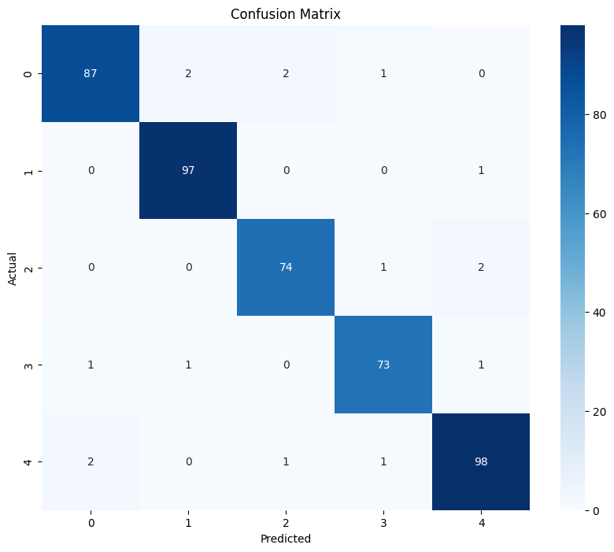

# Text Classification - Comparing XGBoost to distilBERT

This repository hosts a practice problem to compare the model performance of XGBoost with distilBERT. The dataset used for this problem is obtained via [Kaggle](https://www.kaggle.com/datasets/tanishqdublish/text-classification-documentation), containing 2225 instances of text data with corresponding categories. The categories include:
* Politics (0)
* Sport (1)
* Technology (2)
* Entertainment (3)
* Business (4)

Lastly, to practice the deployment of machine learning models, the trained XGBoost model will be exported using pickle.
It will then be used within a Flask API and website to service the model to a potential end-user.
To make deployment of the model easier, a Dockerfile has been created that can be used to start the Flask API within a container.

## Preprocessing
Before performing training or even Exploratory Data Analysis (EDA), we must conduct some preprocessing. As we are dealing with text data and this is a Natural Language Processing (NLP) problem, the following steps are performed:
1. Removing special characters and digits
2. Removing multiple whitespaces
3. Removing leading and trailing whitespaces
4. Converting the text to lowercase
5. Removing punctuation
6. Removing stop words and performing stemming

## EDA Results
Firstly, we aim to understand the distribution of the dependent variable that we are trying to predict. Plotting this will help reveal if there is a skewed distribution of labels present, which might impact the model's performance.



As we can see, there is no significant outlier in terms of distribution for the dependent variable. Next, we will examine the top 20 most common words used in the text after preprocessing.



Lastly, we will look at the bi-grams and tri-grams, which indicate the most common combinations of two and three-word pairings within the dataset.

Bi-gram           |  Tri-gram
:-------------------------:|:-------------------------:
  |  

## Model Performance - XGBoost

### Training Hyperparameters
The following table displays the hyperparameters that were used to train the XGBoost model and the best-found parameters using Random-Search with 5-fold Cross-Validation.

| Hyperparameter      | Options                              | Best Value |
|---------------------|--------------------------------------|------------|
| `n_estimators`      | [100, 200, 300, 400, 500]            | 400        |
| `learning_rate`     | [0.01, 0.1, 0.2, 0.3]                | 0.2        |
| `max_depth`         | [3, 4, 5, 6, 7, 8, 9, 10]            | 5          |
| `subsample`         | [0.6, 0.7, 0.8, 0.9, 1.0]            | 0.6        |
| `colsample_bytree`  | [0.6, 0.7, 0.8, 0.9, 1.0]            | 0.6        |
| `gamma`             | [0, 0.1, 0.2, 0.3, 0.4]              | 0.1        |
| `min_child_weight`  | [1, 2, 3, 4, 5]                      | 1          |

### Model Evaluation Results
Accuracy was chosen as the evaluation metric. For the XGBoost model, the accuracy score was 0.964 on the testing data. The following confusion matrix identifies wrongly classified texts:



From this analysis, it appears that the most common errors are False Positives for Class 0 and False Negatives for Class 4. This means that the model is more likely to incorrectly predict other classes as Class 0 and fail to predict Class 4 correctly.

## Requirements
* Docker Desktop

## Running the Flask Web-App
The following command will start to build the Docker image:
```
docker build -t news-text-clf-flask-app .
```

The following command will start the image within the Docker Desktop Application:
```
docker run -d -p 4996:4996 news-text-clf-flask-app
```
After running both commands, the application will be reachable by navigating to http://127.0.0.1:4996.

*Note:* It is important that you are in the same directory as the Dockerfile for the above commands to work.